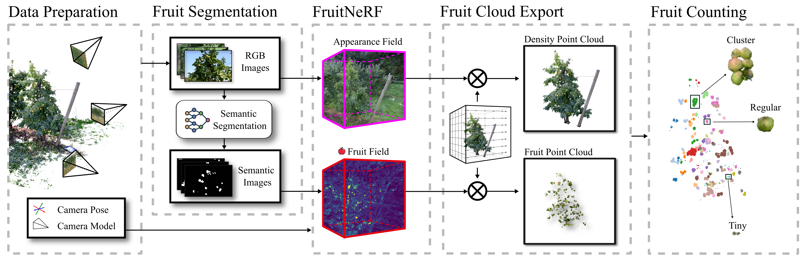
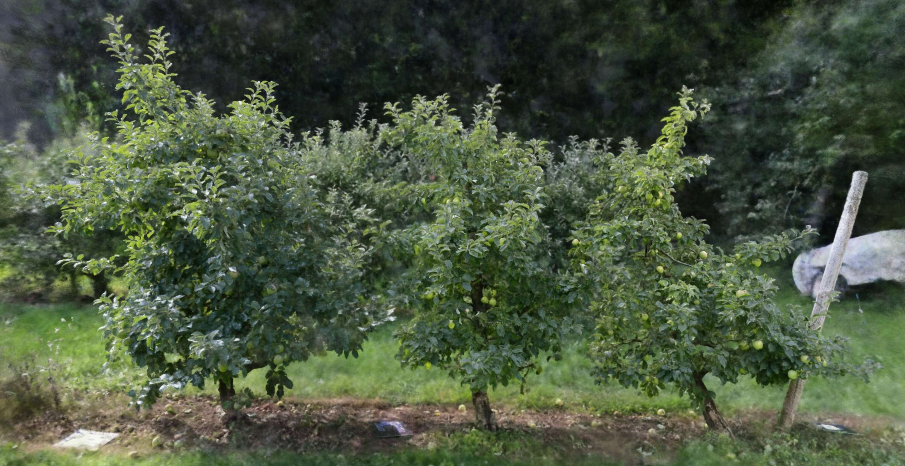

<h1 style="text-align: center;">:apple: :pear: FruitNeRF: A Generalized Framework for Counting Fruits in Neural Radiance Fields :peach: :lemon:</h1>

Lukas Meyer, Andreas Gilson, Ute Schmid, Marc Stamminger <br>

<p align="center">
<a href="https://meyerls.github.io/fruit_nerf/">🌐[Project Page]</a>
<a href="https://meyerls.github.io/fruit_nerf/">📄[Paper]</a>
<a href="https://zenodo.org/records/10869455">📁[Dataset]</a>
</p>

<p style="align:justify"><b>Abstract</b>: We introduce FruitNeRF, a unified novel fruit counting framework that leverages state-of-the-art view synthesis methods
to count any fruit type directly in 3D. Our framework takes an unordered set of posed images captured by a monocular
camera and segments fruit in each image. To make our system independent of the fruit type, we employ a foundation model
that generates binary segmentation masks for any fruit. Utilizing both modalities, RGB and semantic, we train a semantic
neural radiance field. Through uniform volume sampling of the implicit Fruit Field, we obtain fruit-only point clouds.
By applying cascaded clustering on the extracted point cloud, our approach achieves precise fruit count. The use of
neural radiance fields provides significant advantages over conventional methods such as object tracking or optical
flow, as the counting itself is lifted into 3D. Our method prevents double counting fruit and avoids counting irrelevant
fruit. We evaluate our methodology using both real-world and synthetic datasets. The real-world dataset consists of
three apple trees with manually counted ground truths, a benchmark apple dataset with one row and ground truth fruit
location, while the synthetic dataset comprises various fruit types including apple, plum, lemon, pear, peach, and
mangoes. Additionally, we assess the performance of fruit counting using the foundation model compared to a U-Net.</p>

<p align="center">
<a href="https://www.fau.eu/"> </a>
<a href="https://www.lgdv.tf.fau.de/"> </a>
<a href="https://unit.aist.go.jp/icps/icps-am/en/"> </a>
<a href="https://unit.aist.go.jp/icps/icps-am/en/"> </a>
</p>


<p align="center">
    
</p>

<!--p align="center">
    
</p-->

# :loudspeaker: News

* 12.08.2024: Paper is available on [Arxiv](https://arxiv.org/abs/2408.06190).
* 30.06.2024: Paper got accepted to IROS.

# Installation

### Install Nerfstudio

<details>
  <summary>Expand for guide</summary>

#### 0. Install Nerfstudio dependencies

[Follow these instructions](https://docs.nerf.studio/quickstart/installation.html) up to and including "
tinycudann" to install dependencies and create an environment.

**Important**: In Section *Install nerfstudio* please install version **0.3.2** via `pip install nerfstudio==0.3.2` not
the latest one!

#### 1. Clone this repo

`git clone https://github.com/meyerls/FruitNeRF.git`

#### 2. Install this repo as a python package

Navigate to this folder and run `python -m pip install -e .`

#### 3. Run `ns-install-cli`

#### Checking the install

Run `ns-train -h`: you should see a list of "subcommand" with fruit_nerf included among them.
</details>

### Install Grounding-SAM

<details>
  <summary>Expand for guide</summary>

Please install Grounding-SAM into the segmentation folder. More details can be found
in [install segment anything](https://github.com/facebookresearch/segment-anything#installation)
and [install GroundingDINO](https://github.com/IDEA-Research/GroundingDINO#install). A copied variant is listed below.

```bash
# Start from FruitNerf root folder.
cd segmentation 

# Clone GroundedSAM repository and rename folder
git clone https://github.com/IDEA-Research/Grounded-Segment-Anything.git grounded_sam
cd grounded_sam

# Checkout version compatible with FruitNeRF
git checkout fe24
```

You should set the environment variable manually as follows if you want to build a local GPU environment for
Grounded-SAM:

```bash
export AM_I_DOCKER=False
export BUILD_WITH_CUDA=True
export CUDA_HOME=/path/to/cuda-11.3/
```

Install Segment Anything:

```bash
python -m pip install -e segment_anything
```

Install Grounding DINO:

```bash
pip install --no-build-isolation -e GroundingDINO
```

Install diffusers and misc:

```bash
pip install --upgrade diffusers[torch]

pip install opencv-python pycocotools matplotlib onnxruntime onnx ipykernel
```

Download pretrained weights

```bash
cd .. # Download into grounded_sam
wget https://dl.fbaipublicfiles.com/segment_anything/sam_vit_h_4b8939.pth
wget https://github.com/IDEA-Research/GroundingDINO/releases/download/v0.1.0-alpha/groundingdino_swint_ogc.pth
```

Install SAM-HQ

```bash
pip install segment-anything-hq
```

Download SAM-HQ checkpoint from [here](https://github.com/SysCV/sam-hq#model-checkpoints) (We recommend ViT-H HQ-SAM)
into the Grounded-Segment-Anything folder.

**Done!**

</details>

# Using FruitNeRF

Now that FruitNeRF is installed you can start counting fruits! You can use your own data, our real or
synthetic [FruitNeRF Dataset](https://zenodo.org/records/10869455) or
the [Fuji Dataset](https://zenodo.org/records/3712808).
If you use ower FruitNeRF dataset you can skip the preparations step and jump to **Training**.

## Prepare own Data

For our data and the Fuji dataset you first have to compute the intrinsic and extrinsic camera parameters and segment
the images using grounded-SAM:

```bash
ns-prepocess-fruit-data --data {path/to/image-dir} --output-dir {path/to/output-dir} --segmentation-class [Str+Str+Str]
```

<details>
  <summary><b>Expand for more options</b></summary>

- ```--data [PATH]```: Path the data, either a video file or a directory of images.
- ```--output-dir [PATH]```: Path to the output directory.
- ```--segmentation-class [Str+Str+Str+...]]``` Text prompt for segmentation with Grounded SAM. Multiple arguments are
  also valid.
- ```--num_downscales [INT]```: Number of times to downscale the images. Default is 3.
- ```--text_threshold [FLOAT]``` Threshold for text prompt/class to segment images. Default value is 0.15.
- ```--box_threshold [FLOAT]``` Threshold for bounding box prediction. Default value is 0.15.
- ```--data_semantic [PATH]```: Predefined path to precomputed masks.
- ```--skip-colmap```: skips COLMAP and generates transforms.json if possible.
- ```--skip_image_processing```: skips copying and downscaling of images and only runs COLMAP if possible and enabled.
- ```--flag_segmentation_image_debug```: saves the masks overlay on rgb images.

</details>

If you already have **binary** segmentation masks please parse the image folder:

```bash
ns-prepocess-fruit-data --data {path/to/image-dir} --output-dir {path/to/output-dir} --data_semantic {path/to/seg-dir} 
```

## Training

#### FruitNerf (~15min)

```bash
ns-train fruit_nerf --data {path/to/workspace-dir} --output-dir {path/to/output-dir}
```

#### FruitNerf Big (~3h)

```bash
ns-train fruit_nerf_big --data {path/to/workspace-dir} --output-dir {path/to/output-dir}
```

## Volumetric Sampling

```bash
ns-export-semantics semantic-pointcloud --load-config {path/to/config.yaml} --output-dir {path/to/export/dir} --use-bounding-box True --bounding-box-min -1 - 1 -1 --bounding-box-max 1 1 1 --num_rays_per_batch 2000 --num_points_per_side 2000
```

<details>
  <summary><b>Expand for more options</b></summary>
- `--config {path/to/config.yaml}`: The config.yaml  can be found in the output dir specified during the ns-train.
- `--bounding-box-min` and `--bounding-box-max`: Values for the bounding box. To find out the best parameters please try out the Crop Viewport in the nerfstudio viewer
- `--num_rays_per_batch`: Number of rays per batch. This depends on the capability of your GPU.
- `--num_points_per_side`: We sample a Volume with NxNxN points. The more points the better the resolution and more compute time.

<p align="center" >
    
</p>

</details>

## Point Cloud Clustering / Fruit Counting

Clustering is not integrated into the nerfstudio pipeline. Therefore, we have created a specific cluster
script (```clustering\run_clustering.py```). 

If you want to use it for your own data you have to create a config profile first:

```python
Apple_GT_1024x1024_300 = {
    "path": "/path/2/extracted/pcd/semantic_colormap.ply",
    "remove_outliers_nb_points": 200, # Clean pcd
    "remove_outliers_radius": 0.01, # Clean pcd
    "down_sample": 0.001, # Voxel downsample for faster computation / clustering
    "eps": 0.01,
    "cluster_merge_distance": 0.04, # Merge distance for small clusters
    "minimum_size_factor": 0.3,
    "min_samples": 100, # Min cluster point size
    'template_path': './clustering/apple_template.ply', # Template apple /fruit
    'apple_template_size': 0.7, # Scale apple template if no gt size is available
    'gt_cluster': "/path/2/gt/mesh/fruits.obj", # or None
    "gt_count": 283 # or None
}
```

Afterward perform the Clustering (see more information in ```clustering\run_clustering.py```!):

```python
Baum = Apple_GT_1024x1024_300
clustering = Clustering(remove_outliers_nb_points=Baum['remove_outliers_nb_points'],
                        remove_outliers_radius=Baum['remove_outliers_radius'],
                        voxel_size_down_sample=Baum['down_sample'],
                        template_path=Baum['template_path'],
                        min_samples=Baum['min_samples'],
                        apple_template_size=Baum['apple_template_size'],
                        gt_cluster=Baum['gt_cluster'],
                        cluster_merge_distance=Baum['cluster_merge_distance'],
                        gt_count=Baum['gt_count']
                        )
count = clustering.count(pcd=Baum["path"], eps=Baum['eps'])
```

For reproducibility, we provide the extracted point clouds for our synthetic and real-world data. From Table I and
Fig.8. Data can be downloaded from [here]().

# Download Data
To reproduce our counting results you can download the extracted point clouds for every training run. Download can be 
found here: tbd.

## Synthetic Dataset

<p align="center" >
    
    
    
    
    
    
</p>

Link: [](https://doi.org/10.5281/zenodo.10869455)

## Real Dataset



Link: [](https://doi.org/10.5281/zenodo.10869455)

## Bibtex

If you find this useful, please cite the paper!
<pre id="codecell0">
@inproceedings{fruitnerf2024,
&nbsp;author     = {Lukas Meyer, Andreas Gilson, Ute Schmidt, Marc Stamminger},
&nbsp;title      = {FruitNeRF: A Unified Neural Radiance Field based Fruit Counting Framework},
&nbsp;booktitle  = {IROS},
&nbsp;year       = {2024},
 url        = {https://meyerls.github.io/fruit_nerf}
} </pre>
